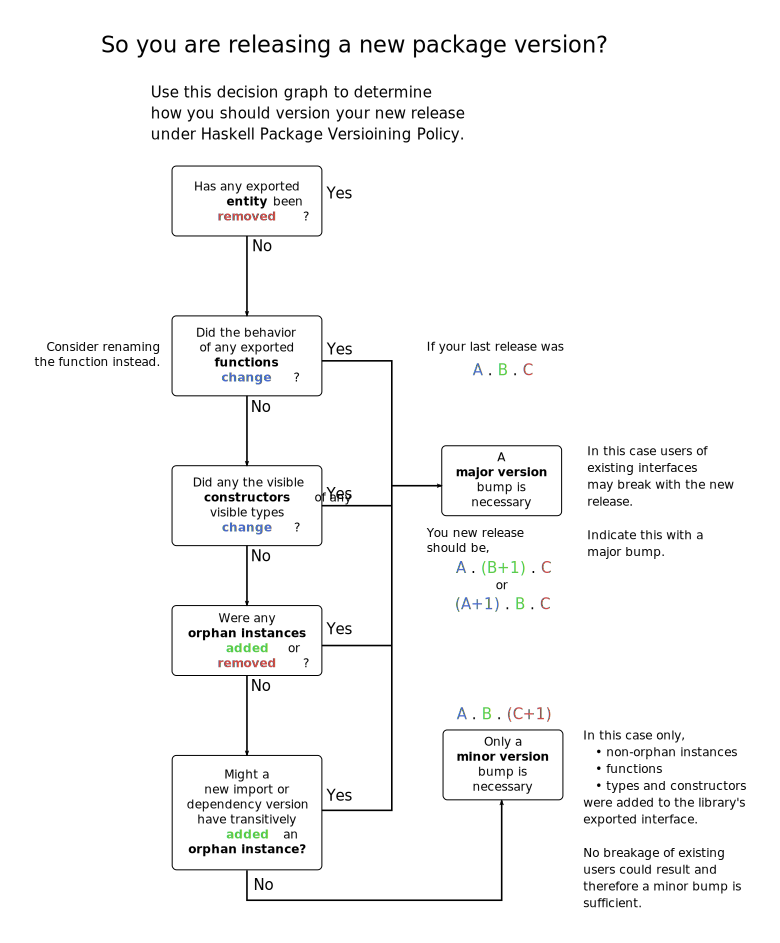

Package versioning policy
=========================

Rationale
---------

The goal of a versioning system is to inform clients of a package of
changes to that package that might affect them, and to provide a way for
clients to specify a particular version or range of versions of a
dependency that they are compatible with.

[Cabal](http://haskell.org/cabal) provides the raw materials for
versioning: it allows packages to specify their own version, and it
allows dependencies that specify which versions of the dependent package
are acceptable. Cabal will select dependencies based on the constraints.

What is missing from this picture is a *policy* that tells the library
developer how to set their version numbers, and tells a client how to
write a dependency that means their package will not try to compile
against an incompatible dependency. For some time there has been an
informal policy in use in the Haskell community, but it became clear
that we were running into trouble with incorrectly-specified
dependencies and unbuildable packages, so this page is an attempt to
formalize the policy.

Version numbers
---------------

The key words "MUST”, “MUST NOT”, “REQUIRED”, “SHALL”, “SHALL NOT”, “SHOULD”,
“SHOULD NOT”, “RECOMMENDED”, “MAY”, and “OPTIONAL” in this document are to be
interpreted as described in [RFC 2119](https://tools.ietf.org/html/rfc2119).

A package version number **SHOULD** have the form *A.B.C*, and **MAY**
optionally have any number of additional components, for example 2.1.0.4
(in this case, *A*=2, *B*=1, *C=0*). This policy defines the meaning of
the first three components *A-C*, the other components can be used in
any way the package maintainer sees fit.

Version number ordering is already defined by Cabal as the lexicographic
ordering of the components. For example, 2.0.1 \> 1.3.2, and 2.0.1.0 \> 2.0.1.
(The `Data.Version.Version` type and its `Ord` instance embody this ordering).

*A.B* is known as the *major* version number, and *C* the *minor*
version number. When a package is updated, the following rules govern
how the version number must change relative to the previous version:

1. *Breaking change*. If any entity was removed, or the types of any entities
or the definitions of datatypes or classes were changed, or orphan instances
were added or any instances were removed, then the new *A.B* **MUST** be
greater than the previous *A.B*. Note that modifying imports or depending on a
newer version of another package may cause extra orphan instances to be
exported and thus force a major version change.

1. *Non-breaking change*. Otherwise, if only new bindings, types, classes,
non-orphan instances or modules (but see below) were added to the interface,
then *A.B* **MAY** remain the same but the new *C* **MUST** be greater than the
old *C*. Note that modifying imports or depending on a newer version of another
package may cause extra non-orphan instances to be exported and thus force a
minor version change.

1. *Other changes*. Otherwise, e.g. if change consist only of corrected
documentation, non-visible change to allow different dependency range etc.
*A.B.C* **MAY** remain the same (other version components may change).

1. *Client specification*. Hence *A.B.C* uniquely identifies the API. A client
that wants to specify that they depend on a particular version of the API can
specify a particular *A.B.C* and be sure of getting that API only. For example,
`build-depends: mypkg >= 2.1.1 && < 2.1.2`.

1. *Backwards compatible client specification*. Often a package maintainer
wants to add to an API without breaking backwards compatibility, and in that
case they can follow the rules of point 2, and increase only *C*. A client
**MAY** specify that they are [insensitive to additions to the
API](https://wiki.haskell.org/Import_modules_properly) by allowing a range of
*C* values, e.g. `build-depends: base >= 2.1.1 && < 2.2`.

1. *Client defines orphan instance*. If a package defines an orphan instance,
it **MUST** depend on the minor version of the packages that define the data
type and the type class to be backwards compatible. For example,
`build-depends: mypkg >= 2.1.1 && < 2.1.2`.

1. *Deprecation*. Deprecated entities (via a `DEPRECATED` pragma) *SHOULD* be
counted as removed for the purposes of upgrading the API, because packages that
use `-Werror` will be broken by the deprecation. In other words the new *A.B*
**SHOULD** be greater than the previous *A.B*.

1. *Adding new modules*. Adding new modules might cause an unavoidable name
collision in dependent code. However, this is usually pretty unlikely,
especially if you keep to your own namespace, so only an increase of the minor
version number is required, in other words *A.B* **MAY** remain the same the
new *C* **MUST** be greater than the old *C*. If, however, your added module
name is taken from another package (e.g. when `network-bytestring` was merged
into `network`) or is quite general (`Data.Set` or something similar) then the
version increase **SHOULD** be major.

Special situations
------------------

### Leaking instances

There is a case where addition or removal of an instance in a package
that the user doesn't depend on directly can still lead to compilation
failures. Consider these three packages:

Package A:

``` {.haskell}
module PackageA where

class Monad m => MonadLogger m
instance MonadLogger IO
```

Package B, depends on package A:

``` {.haskell}
module PackageB where

import PackageA

f :: MonadLogger m => Int -> m String
f = return . show
```

Package C, depends on package B:

``` {.haskell}
module Package C where

import PackageB

main :: IO ()
main = f 5 >>= print
```

Now consider this scenario:

1.  Package A removes the `IO`{.haskell} instance and gets its major
    version number bumped, as required by the PVP.
2.  Package B, which can still work with the old and new version of
    package A, changes its dependency on package A to allow for both
    versions. Package B only gets a patch-level bump.
3.  Package C might or might not compile, depending on which patch-level
    version of package B is used.

The PVP could required that package B must bump its major version number
as it now (re-)exports one fewer instances. This will however require
more frequent version bumps in the whole ecosystem. As a pragmatic
solution, for now the PVP doesn't required a major version bump in this
case and instead leaves it to package C to add a dependency on package A
to handle this situation.

### Version tags

The components of the version number **MUST** be numbers! Historically Cabal
supported version numbers with string tags at the end, e.g. `1.0-beta`
This proved not to work well because the ordering for tags was not well
defined. Version tags are [no longer
supported](https://github.com/haskell/cabal/issues/890) and mostly
ignored, however some tools will fail in some circumstances if they
encounter them.

This can sometimes trip you up if you accidentally stumble into using
the deprecated tags syntax without realising it, for example a version
number with a date like `1.0.2014-01-27` would be interpreted as the
version `1.0.2014` with tags `01` and `27`.


Decision Tree
-------------

The (incomplete!) decision tree summarises the PVP rules in a concise form



Dependencies in Cabal
---------------------

When publishing a Cabal package, you **SHALL** ensure that your
dependencies in the `build-depends` field are accurate. This means
specifying not only lower bounds, but also upper bounds on every
dependency.

At some point in the future, Hackage may refuse to accept packages that
do not follow this convention. The aim is that before this happens, we
will put in place tool support that makes it easier to follow the
convention and less painful when dependencies are updated.

To minimize breakage when new package versions are released, you can use
dependencies that are insensitive to minor version changes (e.g.
`foo >= 1.2.1 && < 1.3`). However, note that this approach is slightly
risky: when a package exports more things than before, there is a chance
that your code will fail to compile due to new name-clash errors. The
risk from new name clashes may be small, but you are on the safe side if
you
[import identifiers explicitly or using qualification](https://wiki.haskell.org/Import_modules_properly).

Version syntax
--------------

Since Cabal 1.6, you can specify an exact API version according to this
policy with the special syntax `package == 1.1.4.*` or an API version up
to additions with `package == 1.1.*`. The former translates into
`package >= 1.1.4 && < 1.1.5`, for example - notice that 1.1.4 *is*
included, rather than just including 1.1.4.0.

Tools
-----

-   script to check for API changes in gtk2hs:
    <http://code.haskell.org/gtk2hs/tools/apidiff/>
-   [precis](http://hackage.haskell.org/package/precis) - a simple tool
    for a first approximation of package API differences, see the
    [announcement](http://www.haskell.org/pipermail/haskell-cafe/2010-April/077023.html)
-   [check-pvp](http://hackage.haskell.org/package/check-pvp) is a program that checks for consistency between package
    dependencies and import style.

Related
-------

-   Sven Moritz Hallberg,
    "[Eternal compatibility in theory](https://wiki.haskell.org/The_Monad.Reader/Issue2/EternalCompatibilityInTheory),"
    [The Monad.Reader](https://wiki.haskell.org/The_Monad.Reader),
    [Issue 2](https://wiki.haskell.org/The_Monad.Reader/Issue2)
-   [Semantic Versioning](http://semver.org/) is similar, but allows for version tags and defines how tags affect the ordering.
